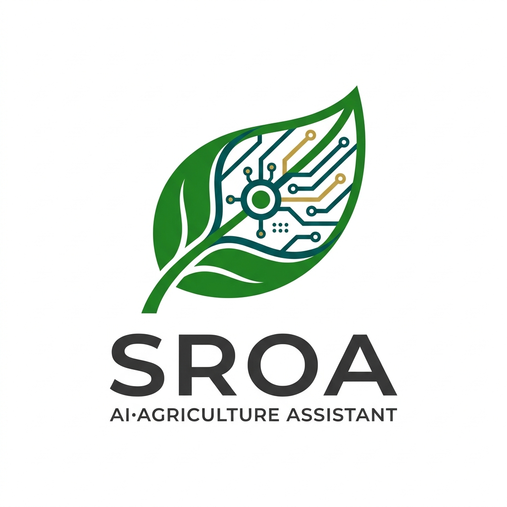
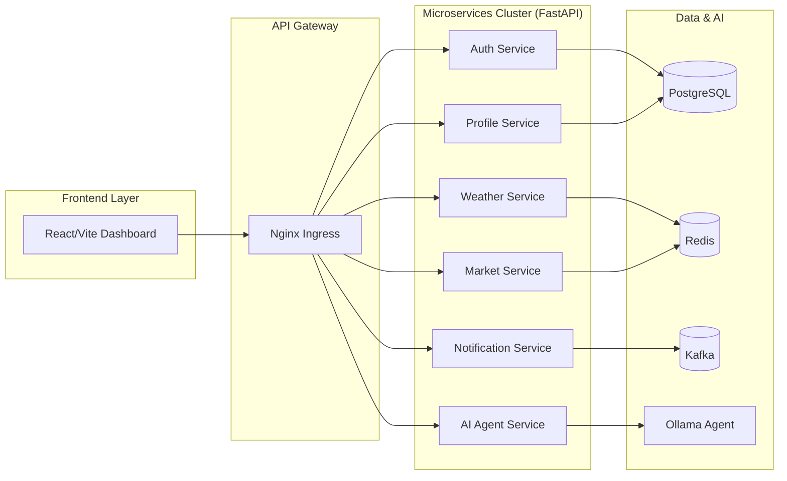
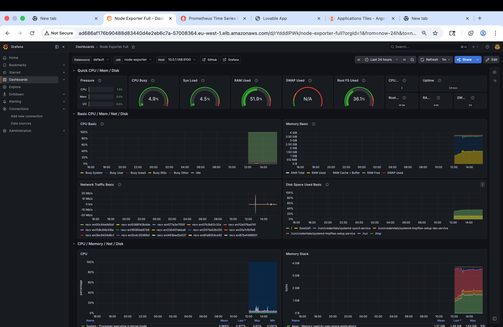
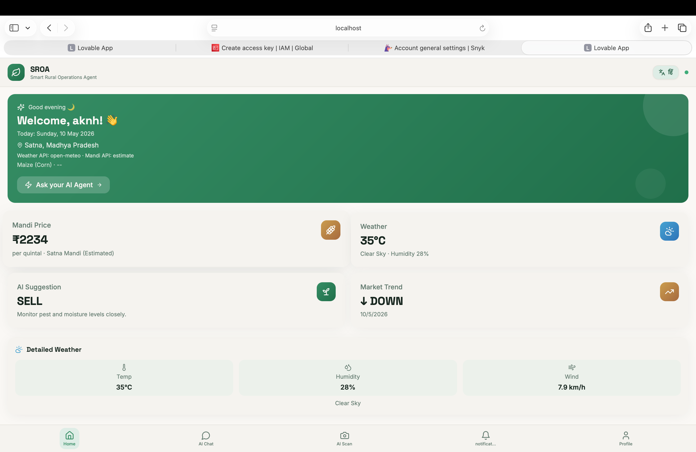
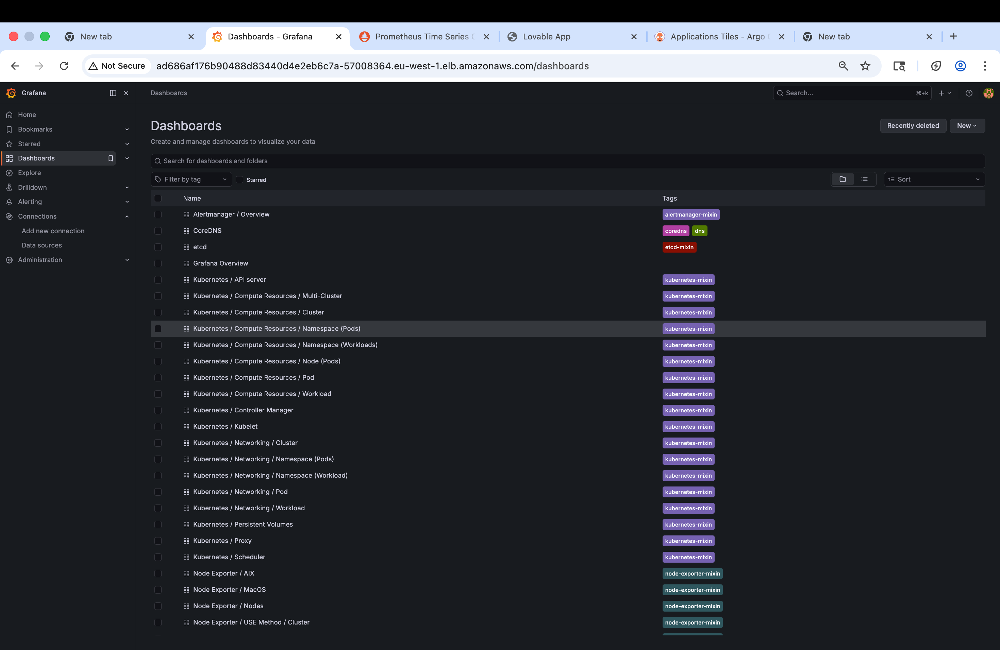
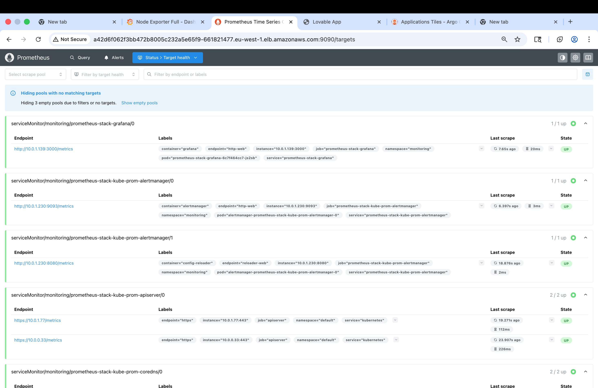

<div align="center">
  
  <h1>🌾 SROA: Smart Rural Operations Agent</h1>
  <p><b>An Advanced AI-Driven Agriculture Assistant Platform</b></p>
  
  <p>
    <a href="https://skillicons.dev">
      
    </a>
  </p>

  [](https://opensource.org/licenses/MIT)
  [](https://github.com/Kanhaiya-Tiwari/Smart-Rural-Operations-Agent/actions)
  [](https://www.terraform.io/)
  [](https://kubernetes.io/)
  [](https://argoproj.github.io/cd/)
</div>

---

## 📖 Overview

**SROA (Smart Rural Operations Agent)** is a cutting-edge, full-stack microservices platform designed to bridge the gap between advanced technology and rural agriculture. By combining **Real-time Data Aggregation**, **Generative AI**, and **Cloud-Native Infrastructure**, SROA provides farmers with actionable insights, risk assessments, and market intelligence.

This project serves as a comprehensive demonstration of modern software engineering, featuring a robust **DevSecOps** pipeline, **Infrastructure as Code (IaC)**, and **GitOps** deployment strategies.

---

## 🛠️ How it Works: Functional Journey

SROA is not just a dashboard; it's an intelligent ecosystem:

1.  **User Onboarding**: Farmers register and set up a **Location-Aware Profile**, specifying their primary crops and notification preferences.
2.  **Data Ingestion**: The system pulls live data from **OpenWeather** (for meteorological tracking) and **AGMARKNET** (for real-time Mandi price monitoring).
3.  **AI Intelligence (The Agent)**: An AI Agent service powered by **LangChain** and **Ollama** analyzes the combined weather and market data. It provides personalized crop recommendations, risk warnings (e.g., impending frost or price drops), and harvest timing advice.
4.  **Notification Engine**: Insights are pushed through a **Kafka-backed** notification service, ensuring farmers receive critical alerts in real-time.
5.  **Stunning UI**: A mobile-first React frontend built with **Vite**, **Tailwind CSS**, and **Framer Motion** ensures the data is accessible and easy to understand.

---

## 🏗️ Technical Architecture



---

## 🧰 Technology Stack

-   **Frontend**: React 18, Vite 5, TypeScript, Tailwind CSS, Framer Motion, TanStack Query.
-   **Backend**: Python 3.11, FastAPI (Microservices), LangChain.
-   **Database**: PostgreSQL (Relational), Redis (Caching).
-   **Messaging**: Apache Kafka (Event-driven architecture).
-   **AI Engine**: Ollama (Local LLM Execution).
-   **DevOps & Cloud**:
    -   **Containerization**: Docker & Docker Compose.
    -   **Infrastructure**: AWS EKS (Elastic Kubernetes Service), VPC, IAM.
    -   **IaC**: Terraform (Modular design).
    -   **CI/CD**: GitHub Actions (9-stage DevSecOps Pipeline).
    -   **GitOps**: ArgoCD (App-of-Apps pattern).
    -   **Security**: Snyk, Trivy, Gitleaks, Bandit, OWASP ZAP.

---

## 🚀 Getting Started

### 1. Local Development (Docker Compose)
Ideal for testing features and UI changes locally.

```bash
# Clone the repository
git clone https://github.com/Kanhaiya-Tiwari/Smart-Rural-Operations-Agent.git
cd Smart-Rural-Operations-Agent

# Setup Environment Variables
cp backend/.env.example backend/.env

# Spin up the stack
docker compose -f backend/docker-compose.yml up -d --build

# Run Frontend
npm install
npm run dev
```

### 2. Cloud Deployment (AWS EKS with Terraform)
This project is designed to be deployed to a production-grade EKS cluster.

#### **A. Provision Infrastructure**
Navigate to the Terraform directory and apply the configuration:
```bash
cd infra/terraform
terraform init
terraform plan
terraform apply
```
*This will create a VPC, EKS Cluster, OIDC providers, and necessary IAM roles.*

#### **B. Configure Access**
```bash
aws eks update-kubeconfig --region <your-region> --name <cluster-name>
```

#### **C. Deploy with GitOps (ArgoCD)**
Install ArgoCD and apply the bootstrap manifest:
```bash
kubectl apply -f infra/argocd/app-of-apps.yaml
```
ArgoCD will automatically synchronize the state of the cluster with the manifests in `infra/k8s/`, deploying all databases, microservices, and networking resources.

---

## 🛡️ CI/CD & DevSecOps
Every push to the `main` branch triggers a comprehensive security-focused pipeline:
1.  **SAST**: Bandit (Python), Gitleaks (Secrets), Shellcheck (Scripts).
2.  **SCA**: Snyk dependency scanning.
3.  **Container Security**: Hadolint (Dockerfile) & Trivy (Image scanning).
4.  **DAST**: OWASP ZAP automated web scanning.
5.  **Automated Deployment**: Seamless push to Amazon ECR and GitOps synchronization.

---

## 🖼️ Gallery & Screenshots

<div align="center">
  <table>
    <tr>
      <td><br>Real-time Weather</td>
      <td><br>Mandi Price Tracker</td>
    </tr>
    <tr>
      <td><br>AI Crop Analysis</td>
      <td><br>Risk Notifications</td>
      <td><br>User Profile Management</td>
    </tr>
    <tr>
      <td><br>Infrastructure Health</td>
      <td><br>ArgoCD GitOps</td>
    </tr>
    <tr>
      <td><br>Mobile Responsive View</td>
    </tr>
  </table>
</div>

---

## 📜 License
Licensed under the [MIT License](LICENSE).

## 👨‍💻 Developed By
**Kanhaiya Tiwari** - *DevOps & Cloud Engineer*  
[GitHub](https://github.com/Kanhaiya-Tiwari) | [Portfolio](https://kanhaiya.dev)
